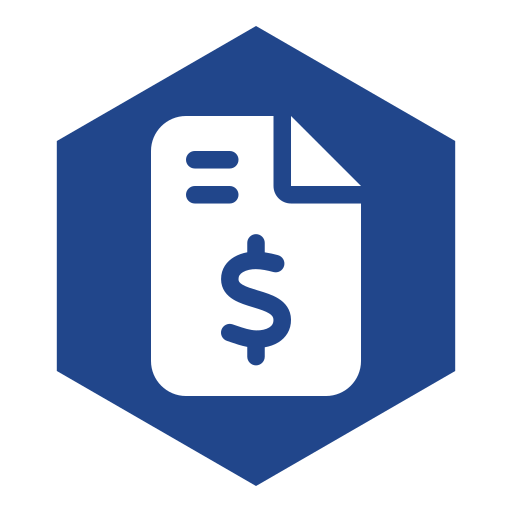

<p align="center">
  
</p>

<h1 align="center">Shillinq</h1>

<p align="center">
  <strong>Complete open-source business administration suite for freelancers, sole proprietors, SMBs, and corporations. Combines bookkeeping, invoicing, procurement, and contract management into one self-hosted solution on Nextcloud. Named after the shilling — one of the oldest and most widely used coins in European history, from the Roman solidus to the British shilling to the East African shilling still in use today. Shillinq covers: Bookkeeping & general ledger (double-entry accounting), Accounts payable & receivable, Sales invoicing & e-invoicing (UBL/Peppol), Purchase orders & procurement workflows, Supplier management & approval chains, Contract lifecycle management (creation, renewal, obligations), Bank reconciliation & payment matching, VAT/tax reporting & compliance, Financial statements (P&L, balance sheet, cash flow), Budget planning & forecasting, Multi-currency support, Dutch government compliance (BBV, IV3, SiSa, DigiInkoop)</strong>
</p>

<p align="center">
  <a href="https://github.com/ConductionNL/shillinq/releases"></a>
  <a href="https://github.com/ConductionNL/shillinq/blob/main/LICENSE"></a>
  <a href="https://github.com/ConductionNL/shillinq/actions"></a>
</p>

---

## Overview

Shillinq is a comprehensive business administration platform designed for organizations of all sizes who need integrated financial, procurement, and contract management. Built as a Nextcloud app, it brings enterprise-grade accounting capabilities to self-hosted environments while maintaining simplicity and accessibility. From small freelancers managing invoices to enterprises handling complex procurement workflows, Shillinq streamlines business operations.

> **Requires:** OpenRegister

## Features

### Other
- **Procurement management**
- **Free plan available for basic procurement management without cost**
- **The procurement department in the buying products**
- **Receipt management with digital storage and search**

### Analytics
- **Management letter tracking**
- **View contract spend dashboard**
- **PO revision management with change tracking and re-approval workflow**
- **Project management with task and milestone tracking**

### Document Management
- **Document management with version control and workflow**
- **Export annual report**
- **Contract repository: centralized document management with full-text search**
- **Supplier qualification management with configurable questionnaires and document requirements**

### AI
- **AI obligation task management with automated deadline tracking**

### Governance
- **Supplier document management with certificate and compliance tracking**
- **Risk management and compliance**

### Core
- **PO amendment management with version history and re-approval workflow**

### Security
- **User role management with granular permission settings**

## Business Case

Market research reveals substantial demand for integrated business administration solutions:

- **154 competitors** analyzed across accounting, procurement, and contract management categories
- **5,929 relevant tenders** identified from government and enterprise procurement channels
- **4,439 features** extracted from market research, competitor analysis, and tender requirements

This data-driven foundation ensures Shillinq addresses real market needs and user pain points.

## Waterschappen BBV variant

For Dutch water boards, Shillinq ships a compliance variant of the
general ledger that maps GL accounts to the BBV (*Besluit Begroting en
Verantwoording*) programme structure, materialises per-programme budget
utilization as a server-side aggregation, and renders a compliance
dashboard with KPI cards, distribution pie, YTD trend, and a
per-programme utilization table.

Scope:

- `BBVProgramme` + `BudgetBBVMapping` schemas with declarative
  validation (allocation sum ≤ 100% per GL account per fiscal year, ±0.1%
  rounding tolerance) and the OpenRegister audit-trail plugin.
- Dashboard at `/apps/shillinq/bbv-dashboard` and budget-mapping CRUD at
  `/apps/shillinq/budget-mappings`.
- Per-programme compliance envelope cached for 1 h, invalidated on any
  GL transaction create/update so the dashboard always reflects current
  spend.

See [Technical → Waterschappen BBV variant](docs/Technical/waterschappen-bbv-variant.md)
for the architecture, admin guide, and audit-export usage.

## Installation

1. Download Shillinq from the [Nextcloud App Store](https://apps.nextcloud.com) or clone this repository
2. Ensure OpenRegister is installed and enabled on your Nextcloud instance
3. Place the app in your Nextcloud `apps/` directory
4. Enable the app through the Nextcloud Administration panel
5. Navigate to the Shillinq application to begin configuration

## Development

### Requirements
- PHP 8.0 or higher
- Nextcloud 25 or later
- OpenRegister app installed

### Setup

```bash
# Clone the repository
git clone https://github.com/ConductionNL/shillinq.git
cd shillinq

# Install dependencies
composer install

# Run quality checks
composer check:strict
```

### Contributing

We welcome contributions from the community. Please ensure code passes our quality standards before submitting pull requests.

## License

This project is licensed under the [European Union Public License 1.2 (EUPL-1.2)](LICENSE).
<!-- hydra repro -->
